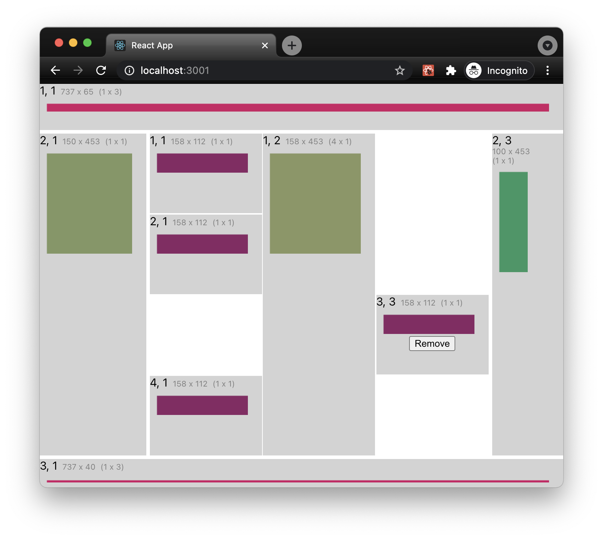

# react-resizable-grid-layout example

This repository is an example application for using the [`react-resizable-grid-layout`](https://github.com/robphilipp/react-grid-layout).

To run this example clone the repository with
```shell
$ git clone https://github.com/robphilipp/react-grid-layout-example.git
```
or
```shell
$ git clone git@github.com:robphilipp/react-grid-layout-example.git
```

Then change into the directory
```shell
$ cd react-grid-layout-example
```

Install the dependencies
```shell
$ npm install
```

And then run the development server
```shell
npm start
```

And, that should open the example app in your default browser.

See the `react-grid-layout` [README](https://github.com/robphilipp/react-grid-layout#readme) for more details.

